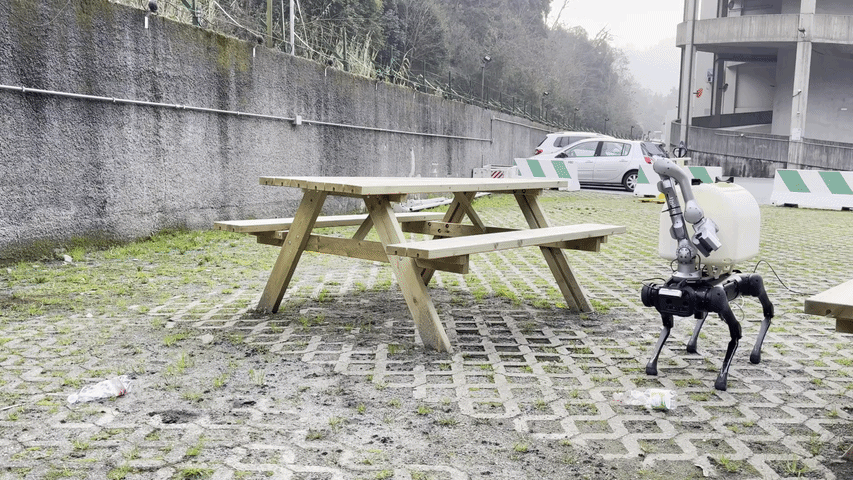
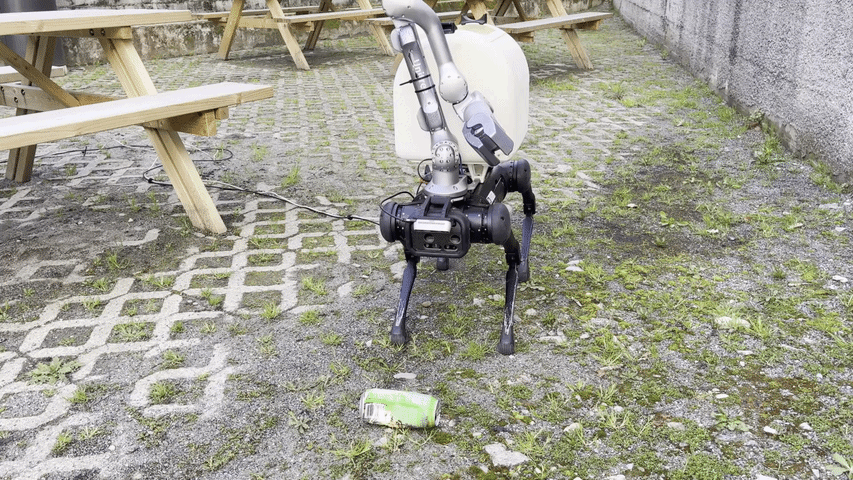
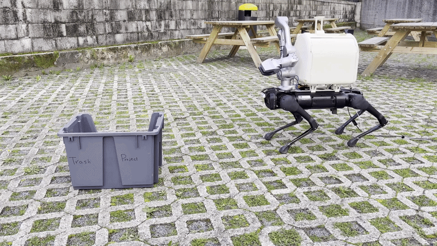

<div style="display: flex; justify-content: space-around;">
  
  
  
  <div style="display: flex; justify-content: space-around;">
    
    
    
  </div>
</div>

## Overview

This repository is about trash collection using RL on quadruped robots, with sim-to-sim and sim-to-real scripts. It trains in sequence two different policies, one for locomotion and a second one for manipulation, able to reach desired end effector poses. In alternative, an inverse kinematic using [mink](https://github.com/kevinzakka/mink) can be used to reach the target.

Features:
- Locomotion policy able to adjust pose and carry a manipulator
- Manipulation policy able to reach desired end effector goal while coordinating the pose of the quadruped (**work in progress - pull request well accepted!**)
- Whole-body Inverse Kinematics with reduced model using [mink](https://github.com/kevinzakka/mink)
- Sim-to-Sim in [Mujoco](https://github.com/google-deepmind/mujoco)
- Sim-to-Real in ROS2 compatible with our public low-level robot's hal for Unitree robots (only z1 for now available - not aliengo) [unitree_ros2_dls](https://github.com/iit-DLSLab/unitree_ros2_dls)

A list of robots available and envs are described below:

| Robot Model         | Environment Name (ID)                                      |
|---------------------|------------------------------------------------------------|
| [Aliengo](https://github.com/iit-DLSLab/gym-quadruped/tree/master/gym_quadruped/robot_model/aliengo) | Locomotion-Aliengo-Flat, Locomotion-Aliengo-Rough-Blind, Locomotion-Aliengo-Rough-Vision |
| [Arm with Z1](https://github.com/iit-DLSLab/gym-quadruped/tree/master/gym_quadruped/robot_model/aliengo) | Manipulation-Aliengo-Flat, Manipulation-Aliengo-Rough-Blind, Manipulation-Aliengo-Rough-Vision |


## Installation and Runs

If you want only to deploy a trained policy on your robot, continue on [README_DEPLOY](https://github.com/iit-DLSLab/trash-collection-isaaclab/blob/main/README_DEPLOY.md) otherwise on [README_TRAIN](https://github.com/iit-DLSLab/trash-collection-isaaclab/blob/main/README_TRAIN.md).

## Cite this work

If you find the work useful, please consider citing:

#### [BinWalker: Development and Field Evaluation of a Quadruped Manipulator Platform for Sustainable Litter Collection](https://arxiv.org/pdf/2603.10529)

```
@article{turrisi26littercollection,
  author = {Giulio Turrisi and Angelo Bratta and Giovanni Minelli and Gabriel Fischer Abati and Amir H. Rad and João Carlos Virgolino Soares and Claudio Semini},
  title = {BinWalker: Development and Field Evaluation of a Quadruped Manipulator Platform for Sustainable Litter Collection},
  journal = {arXiv},
  year = {2026}
}
```

## Maintainer

This repository is maintained by [Giulio Turrisi](https://github.com/giulioturrisi).
